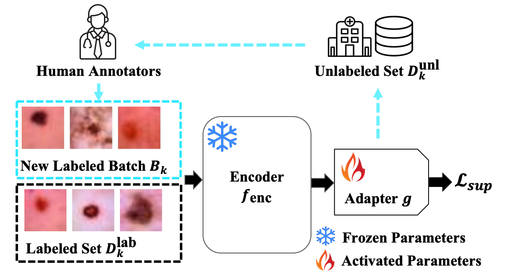
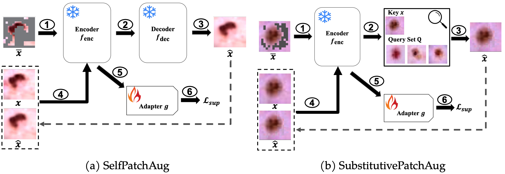

# DA4AL
Codes for [Exploring Minimally Sufficient Representation in Active Learning through Label-Irrelevant Patch Augmentation](https://openreview.net/pdf?id=MlgnGWdqWl), CPAL 2023.

## Framework
<p align="center">


</p>

## Prerequisites 
You can use the following command to initial conda environment
```
conda env create -f environment.ymal
```

## Baselines
```
python demo_baseline.py \
      --ALstrategy LeastConfidence \
      --initseed 10 \
      --round 50 \
      --batch 5 \
      --dataset_name OrganCMNIST \
      --seed 4666 \
      --iteration 1 \
      --gpu <Your GPU ID> \
      --data_path <Your Path to Store Datasets> \
      --pretrained_model_path <Your Path to Store Pretrained Models> \
      --out_path <Your Path to Store the Results> \
      --model resnet18
```
Params Choices
```
--ALstrategy: 
'EntropySampling', 'LeastConfidence', 'MarginSampling', 'LeastConfidenceDropout' 'MarginSamplingDropout', 'EntropySamplingDropout', 'KCenterGreedy', 'RandomSampling', 'MeanSTD', 'BALDDropout', 'BadgeSampling'

--dataset_name: 'CIFAR10','TinyImageNet','DermaMNIST','BreastMNIST', 'PathMNIST','PneumoniaMNIST','TissueMNIST','OCTMNIST','OrganAMNIST','OrganCMNIST','OrganSMNIST','BloodMNIST'

--model: 'resnet18','resnet34','resnet50','vgg16','alexnet','mobilenet','resnet18_pretrain','resnet34_pretrain','resnet50_pretrain','resnet18_pretrain_ft','resnet34_pretrain_ft','resnet50_pretrain_ft'
```
## Our Framework
Pretrained weights for MoCo-V3 and DINO can be downloaded [here](), and change `WEIGHT_PATH_BASE` in file `arguments.py` as follows.
```
WEIGHT_PATH_BASE = {
  'MoCo': <Your Own Path>,
  'DINO': <Your Own Path>
}
```
#### Existing DA Methods
```
# AutoAug on DINO
python demo_mae.py \
      --ALstrategy LeastConfidence \
      --initseed 10 \
      --round 50 \
      --batch 5 \
      --dataset_name OrganCMNIST \
      --seed 4666 \
      --iteration 1 \
      --gpu <Your GPU ID> \
      --data_path <Your Path to Store Datasets> \
      --pretrained_model_path <Your Path to Store Pretrained Models> \
      --out_path <Your Path to Store the Results> \
      --tau 0 \
      --aug_strategy Auto \
      --local_ratio 0.75 \
      --local_strategy Att_Last \
      --semi_decay 1 \
      --pretrained_data DINO
```
The `--Aug Strategy` can be `'No', 'Normal','Auto','Rand'`

#### SelfPatchAug
```
# SelfPatchAug on MAE
python demo_mae.py \
      --ALstrategy LeastConfidence \
      --initseed 10 \
      --round 50 \
      --batch 5 \
      --dataset_name OrganCMNIST \
      --seed 4666 \
      --iteration 1 \
      --gpu <Your GPU ID> \
      --data_path <Your Path to Store Datasets> \
      --pretrained_model_path <Your Path to Store Pretrained Models> \
      --out_path <Your Path to Store the Results> \
      --tau 0 \
      --aug_strategy Self \
      --local_ratio 0.75 \
      --local_strategy Att_Last \
      --semi_decay 1 \
      --pretrained_data General
```
Note that `'--pretrained_data'` should be `'General'` for SelfPatchAug, since SelfPatchAug can only work on MAE.


#### SubstitutivePatchAug

For SubstitutivePatchAug, we need to compute the similaity matrix for representations at first.
```
python compute_dis_matrix.py \
      --ALstrategy LeastConfidence \
      --initseed 10 \
      --dataset_name OrganCMNIST \
      --seed 4666 \
      --gpu <Your GPU ID> \
      --data_path <Your Path to Store Datasets> \
      --pretrained_model_path <Your Path to Store Pretrained Models> \
      --out_path <Your Path to Store the Results> \
      --pretrained_data DINO
```

and then
```
# SubstitutivePatchAug on DINO
python demo_mae.py \
      --ALstrategy LeastConfidence \
      --initseed 10 \
      --round 50 \
      --batch 5 \
      --dataset_name OrganCMNIST \
      --seed 4666 \
      --iteration 1 \
      --gpu <Your GPU ID> \
      --data_path <Your Path to Store Datasets> \
      --pretrained_model_path <Your Path to Store Pretrained Models> \
      --out_path <Your Path to Store the Results> \
      --tau 0 \
      --aug_strategy SamplePatchAug \
      --local_ratio 0.75 \
      --local_strategy Att_Last \
      --semi_decay 1 \
      --pretrained_data DINO
```

## Citing

If you found this repository useful, please consider citing our paper.

```
@inproceedings{xue2023exploring,
  title={Exploring Minimally Sufficient Representation in Active Learning through Label-Irrelevant Patch Augmentation},
  author={Xue, Zhiyu and Dai, Yinlong and Lei, Qi},
  booktitle={Conference on Parsimony and Learning (Proceedings Track)},
  year={2023}
}
```

## Credits
This repository is heavily based on [DeepAL+: Deep Active Learning Toolkit](https://github.com/SineZHAN/deepALplus). We thank the authors for opening the source codes.

## Contact

Please contact xzy990228@gmail.com if you have any questions.


